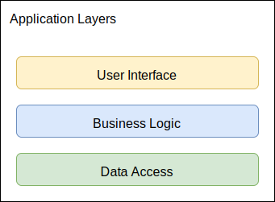

# Microservice Product Order

## Description

This microservice is designed for migrating and normalizing product data related to orders.  
It imports and transforms denormalized order files, converting them into normalized JSON structures for easier querying
and management.

### Main Features:

- File import and normalization for order products.
- Query functionality for normalized order products in JSON format.

---

## Technology Stack

The project leverages the following technologies:

- **Java 21**
- **Spring Boot 3**
- **MongoDB**
- **Docker**

---

## Architecture

This project follows a layered architecture due to its simplicity and small scope, ensuring clear organization and
separation of responsibilities.

### Structure

The project is divided into two main packages:

1. **Model**:
    - Contains domain entities and business rules essential to the application.
    - Defines repository interfaces for data access.

2. **Controller**:
    - Implements the REST API for external communication.
    - Manages input/output requests and responses.



---

## Getting Started

### Prerequisites

- Docker installed on your machine.

### Running the Application

1. **Start Dependencies with Docker**  
   Navigate to the `/helper/docker` directory and run:
   ```
   docker-compose up
   ```

2. **Start the Application**

   Run the following command to start the Spring Boot application:
   ```shell
   ./mvnw spring-boot:run
   ```

## Build and Test

### Build the Application

```shell
./mvnw clean install
```

## Run Unit Tests

```shell
./mvnw test
```

## Generate Test Coverage Report

```shell
./mvnw clean verify
```

## View Test Coverage

After running jacoco:report, you can find the test coverage report in the target/site/jacoco/index.html file.
Open this file in a browser to view the detailed test coverage metrics.

